# Manual de Usuario - RRHH Peixos Puignau

## Plataforma de Gestion de Nominas

**Version:** PRP-003 v1.0
**Fecha:** Marzo 2026
**URL:** https://rrhh.jonadata.cloud

---

## 1. Introduccion

La plataforma RRHH Peixos Puignau automatiza la gestion mensual de nominas. Permite registrar datos variables, generar informes de costes, comparar con los datos de la gestoria y crear asientos contables de forma guiada.

Este manual esta organizado siguiendo el flujo real de trabajo: primero la configuracion inicial (una sola vez) y despues el ciclo mensual que se repite cada mes.

---

## 2. Configuracion Inicial (una sola vez)

Antes de empezar el ciclo mensual, hay que configurar los datos base de la empresa. Esto solo se hace una vez (y se actualiza cuando haya cambios).

### 2.1 Departamentos

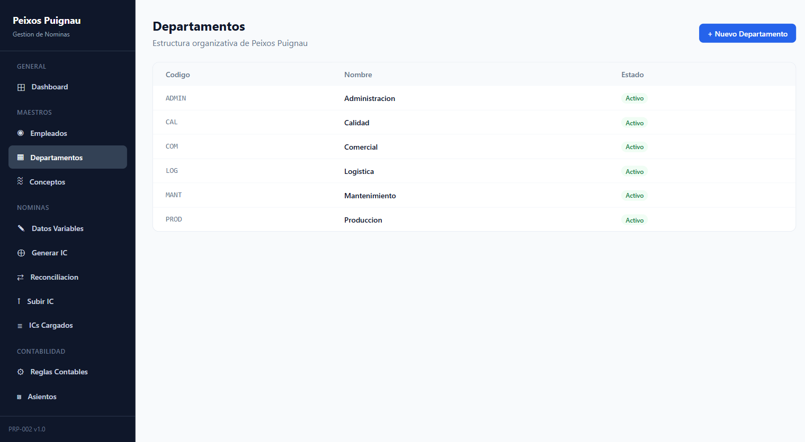

**Donde:** Menu lateral > Maestros > Departamentos

**Que hacer:** Crear los departamentos de la empresa.

**Como hacerlo:**

1. Click en **"+ Nuevo Departamento"**
2. Indicar el codigo (ej: PROD) y el nombre (ej: Produccion)
3. Guardar

**Departamentos actuales:**

| Codigo | Nombre |
|--------|--------|
| ADMIN | Administracion |
| CAL | Calidad |
| COM | Comercial |
| LOG | Logistica |
| MANT | Mantenimiento |
| PROD | Produccion |

### 2.2 Empleados

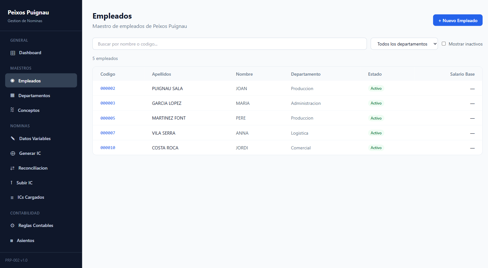

**Donde:** Menu lateral > Maestros > Empleados

**Que hacer:** Dar de alta a todos los empleados con sus datos contractuales.

**Como hacerlo:**

1. Click en **"+ Nuevo Empleado"**
2. Rellenar los datos:
   - **Datos Basicos:** Codigo, Nombre, Apellidos, NIF
   - **Organizacion:** Departamento, Centro de Coste
   - **Contrato:** Tipo (Indefinido/Temporal/Practicas/Formacion), Fecha de alta, Salario base
3. Guardar

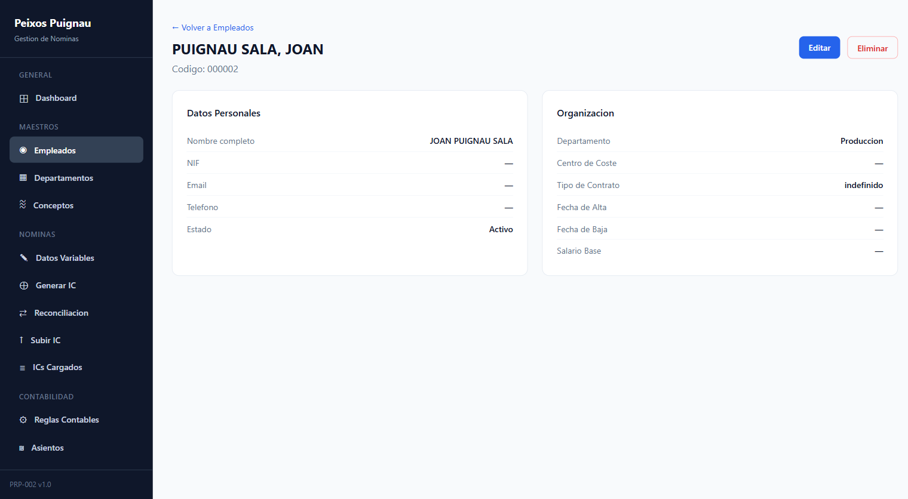

**Para ver o editar un empleado:** Click en su codigo en la lista.

**Herramientas de busqueda:**

- Campo de texto para buscar por nombre o codigo
- Filtro por departamento
- Checkbox para mostrar empleados inactivos

### 2.3 Conceptos Salariales

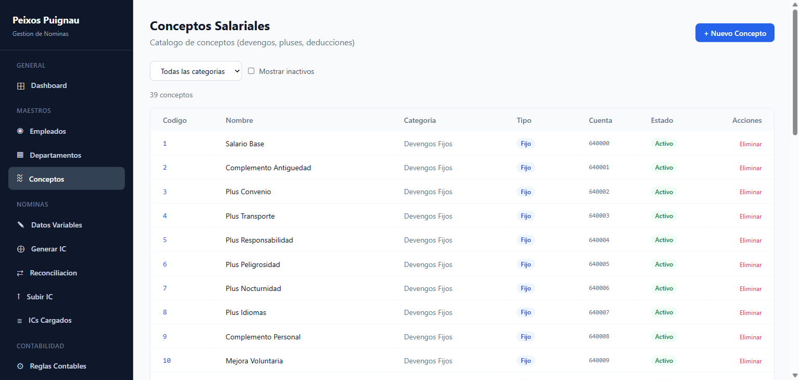

**Donde:** Menu lateral > Maestros > Conceptos

**Que hacer:** Revisar el catalogo de conceptos de nomina. Ya vienen precargados los mas comunes.

Los conceptos se organizan en 4 categorias:

| Categoria | Que es | Ejemplos |
|-----------|--------|----------|
| **Devengos Fijos** | Ingresos fijos cada mes | Salario Base, Plus Convenio, Plus Transporte |
| **Devengos Variables** | Ingresos que cambian cada mes | Horas Extras, Comisiones, Incentivos |
| **Deducciones** | Descuentos al trabajador | Contingencias Comunes, IRPF, Embargos |
| **Empresa** | Costes a cargo de la empresa | SS Empresa, FOGASA, Accidentes |

**Para crear un concepto nuevo:** Click en "+ Nuevo Concepto", indicar codigo, nombre, categoria y cuenta contable.

### 2.4 Reglas Contables

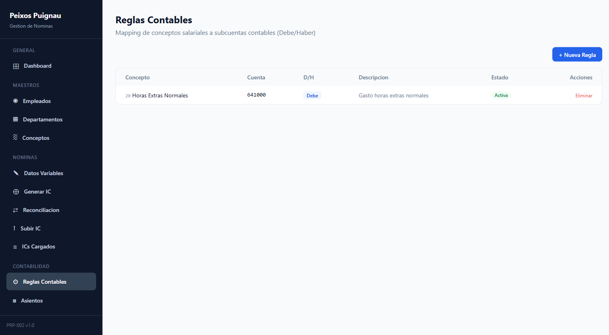

**Donde:** Menu lateral > Contabilidad > Reglas Contables

**Que hacer:** Definir como cada concepto de nomina se traduce a cuentas contables (Debe y Haber).

**Ejemplo de configuracion tipica:**

| Concepto | Cuenta | D/H | Para que |
|----------|--------|-----|----------|
| Salario Base | 640000 | Debe | Gasto salario |
| Salario Base | 465000 | Haber | Remuneraciones pendientes de pago |
| IRPF | 473000 | Haber | Hacienda acreedora |
| SS Empresa | 642000 | Debe | Gasto Seguridad Social |
| SS Empresa | 476000 | Haber | Organismos SS acreedores |

**Para crear una regla nueva:**

1. Click en **"+ Nueva Regla"**
2. Seleccionar concepto, cuenta contable y si va al Debe o al Haber
3. Guardar

---

## 3. Ciclo Mensual Paso a Paso

Cada mes hay que seguir estos 5 pasos en orden. El Dashboard te muestra en que paso estas.

### Paso 1: Registrar Datos Variables

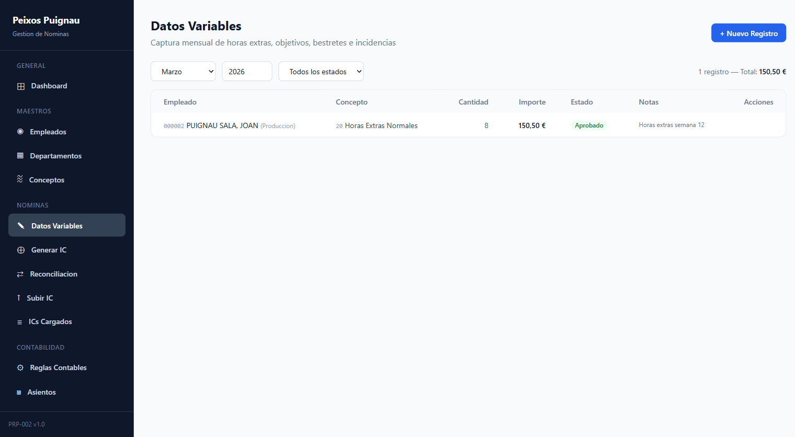

**Donde:** Menu lateral > Nominas > Datos Variables

**Que hacer:** Registrar las horas extras, complementos variables, incidencias y cualquier concepto que cambie cada mes.

**Como hacerlo:**

1. Seleccionar el **mes** y **ano** en los filtros superiores
2. Click en **"+ Nuevo Registro"**
3. Seleccionar el empleado
4. Seleccionar el concepto variable (ej: Horas Extras Normales)
5. Indicar la cantidad y el importe
6. Guardar
7. **Importante:** Cambiar el estado de cada registro a **Aprobado**

**Regla critica:** Solo los datos en estado **Aprobado** se incluiran en el siguiente paso (Generar IC). Los datos en Borrador, Enviado o Rechazado NO se incluyen.

**Flujo de estados:**

```
Borrador → Enviado → Aprobado → (listo para generar IC)
                   → Rechazado
```

### Paso 2: Generar IC Interno

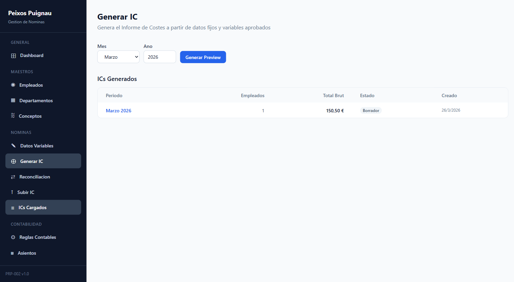

**Donde:** Menu lateral > Nominas > Generar IC

**Que hacer:** Generar el Informe de Costes interno que combina los datos fijos de cada empleado con los datos variables aprobados del mes.

**Como hacerlo:**

1. Seleccionar el **mes** y **ano**
2. Click en **"Generar Preview"**
3. El sistema calculara automaticamente:
   - Conceptos fijos de cada empleado activo
   - Datos variables aprobados del mes
   - Total bruto
4. Revisar que los datos sean correctos
5. Click en **"Confirmar IC"** para guardarlo

### Paso 3: Subir IC de la Gestoria

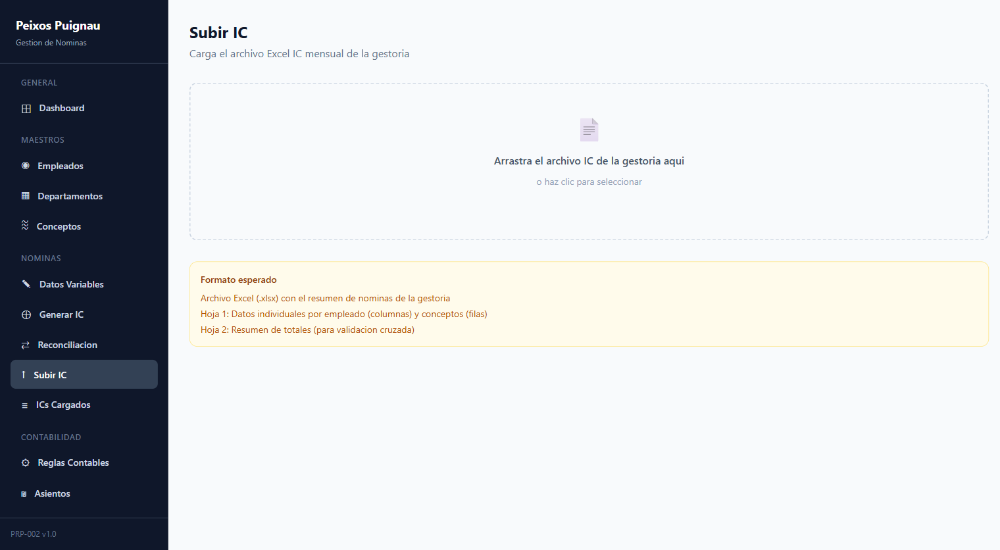

**Donde:** Menu lateral > Nominas > Subir IC

**Que hacer:** Cargar el archivo Excel que envia la gestoria con el resumen de nominas del mes.

**Como hacerlo:**

1. Recibir el archivo Excel (.xlsx) de la gestoria
2. **Arrastrar y soltar** el archivo sobre la zona punteada (o hacer click para seleccionarlo)
3. El sistema procesara el archivo y mostrara un resumen con:
   - Periodo detectado
   - Numero de empleados
   - Total bruto
   - Lista de conceptos

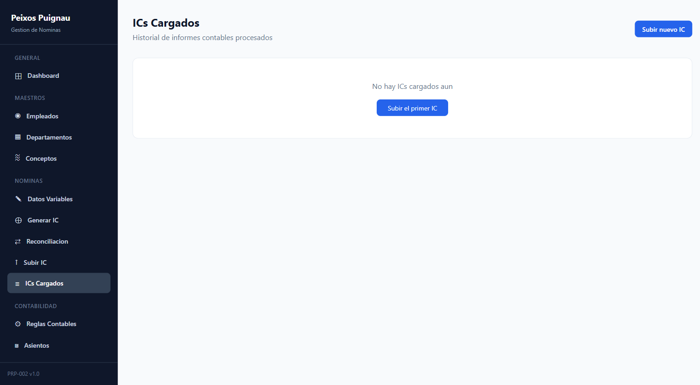

**Para ver el historial de archivos subidos:** Menu lateral > Nominas > ICs Cargados

### Paso 4: Reconciliacion

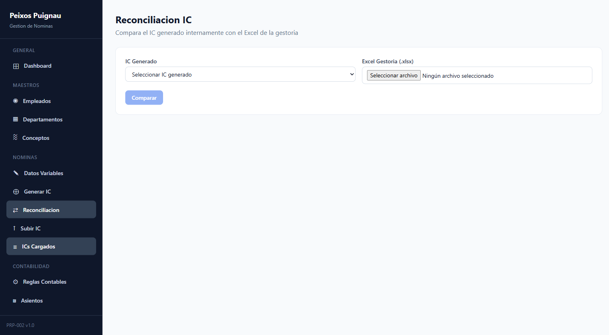

**Donde:** Menu lateral > Nominas > Reconciliacion

**Que hacer:** Comparar el IC generado internamente (Paso 2) con el Excel de la gestoria (Paso 3) para detectar diferencias.

**Como hacerlo:**

1. Seleccionar el **IC Generado** del desplegable
2. Subir el **Excel de la gestoria**
3. Click en **"Comparar"**
4. El sistema mostrara:
   - Lineas que coinciden
   - Lineas con diferencias de importes
   - Lineas que solo estan en un lado
5. Revisar y resolver las discrepancias

### Paso 5: Generar Asiento Contable

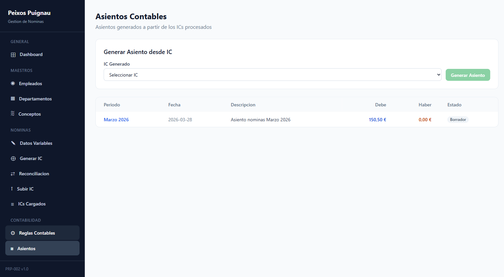

**Donde:** Menu lateral > Contabilidad > Asientos

**Que hacer:** Crear el asiento contable del mes aplicando las reglas contables configuradas.

**Como hacerlo:**

1. En la seccion **"Generar Asiento desde IC"**, seleccionar el IC del mes
2. Click en **"Generar Asiento"**
3. El sistema aplicara las reglas contables para crear las lineas
4. Revisar que el asiento cuadre (Total Debe = Total Haber)
5. Click en **"Confirmar"** cuando este correcto

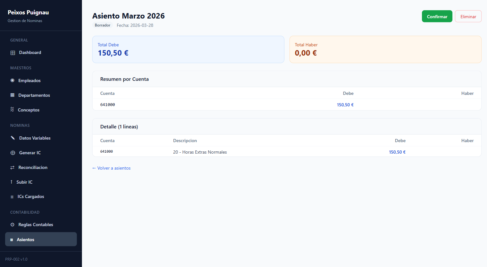

**En el detalle del asiento puedes ver:**

- Totales de Debe y Haber
- Resumen agrupado por cuenta contable
- Todas las lineas individuales del asiento

---

## 4. El Dashboard

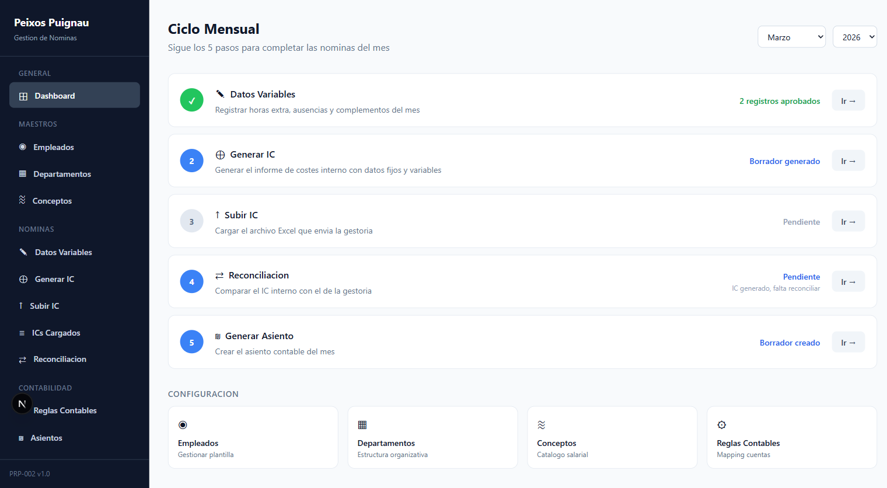

**Donde:** Menu lateral > General > Dashboard

El Dashboard es tu punto de partida. Muestra los 5 pasos del ciclo mensual con el estado actual de cada uno:

- **Verde** = Paso completado
- **Azul** = Paso en progreso
- **Gris** = Paso pendiente

Puedes cambiar el mes y ano para ver el estado de cualquier periodo.

Debajo de los pasos, tienes accesos rapidos a la configuracion (Empleados, Departamentos, Conceptos, Reglas).

---

## 5. Preguntas Frecuentes

**P: En que orden debo seguir los pasos?**
R: Siempre en el mismo orden: 1) Datos Variables → 2) Generar IC → 3) Subir IC → 4) Reconciliacion → 5) Generar Asiento. El Dashboard te guia.

**P: Que pasa si no apruebo los datos variables?**
R: Los datos que no esten en estado "Aprobado" no se incluiran al generar el IC. Asegurate de aprobar todos los registros antes del Paso 2.

**P: Que formato debe tener el archivo Excel de la gestoria?**
R: Archivo .xlsx con empleados en columnas y conceptos en filas. Periodo en fila 4, "TOTAL BRUT" al final. Tu gestoria ya conoce este formato.

**P: Que pasa si el asiento no cuadra (Debe diferente a Haber)?**
R: Revisa las Reglas Contables. Cada concepto necesita al menos una linea de Debe y una de Haber. Verifica que no falte ninguna regla.

**P: Puedo editar un asiento ya confirmado?**
R: No. Los asientos confirmados no se pueden modificar. Si necesitas cambios, eliminalo y genera uno nuevo.

**P: Que conceptos se incluyen al generar el IC?**
R: Los conceptos fijos asignados a empleados activos + los datos variables del mes en estado "Aprobado".

**P: Puedo usar la aplicacion en el movil?**
R: Si, la interfaz se adapta a moviles, pero se recomienda pantalla de escritorio para trabajar con las tablas.

---

## 6. Soporte

Para consultas o incidencias:

- **Empresa:** Bitalize / Jonadata
- **Plataforma:** https://rrhh.jonadata.cloud
